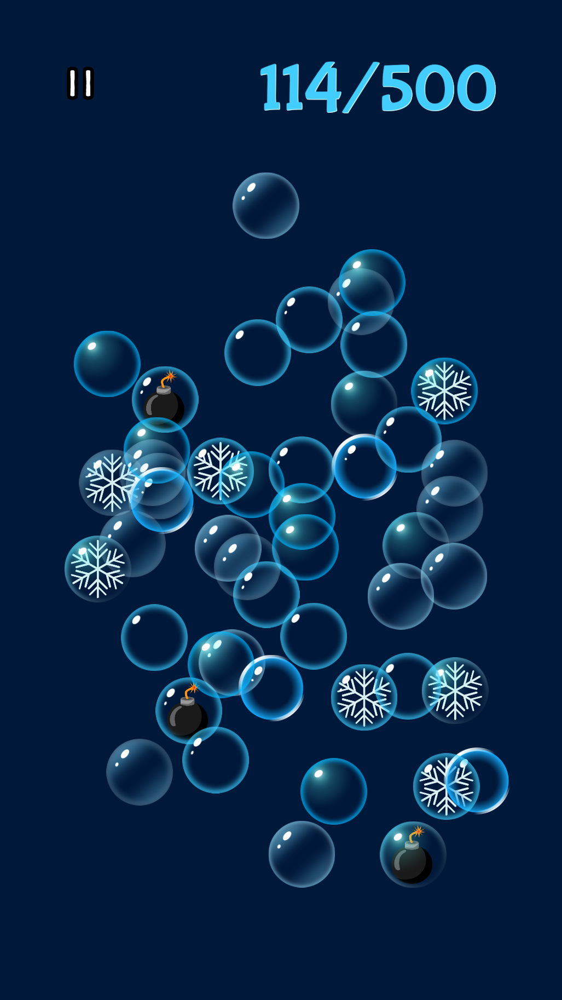
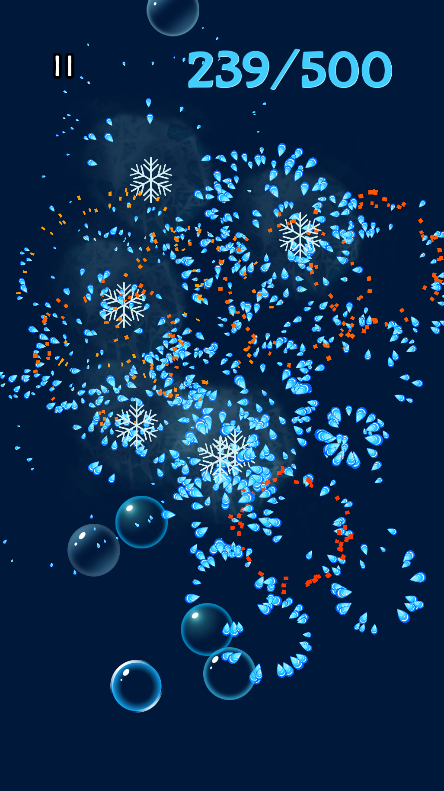
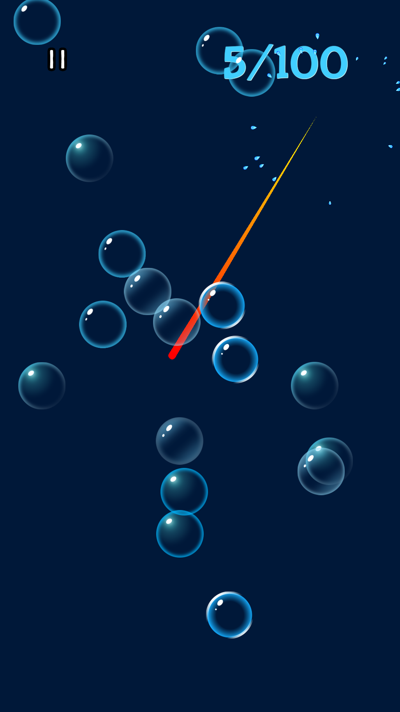
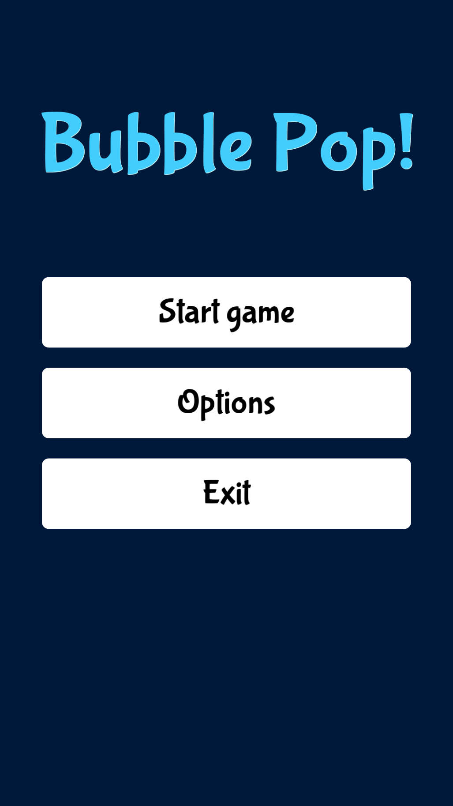

# Bubble Pop

Simple bubble pop game made with [godot](https://godotengine.org/)

## Screenshots

## License
All code is MIT licenced, other content such as assets are under their own license

## Asset Credits
### Assets I downloaded
 * [Bubbles by cassala](https://cassala.itch.io/bubble-sprites) CC-0
 * [pop sound](https://starsoftware.itch.io/pop-sound) - License isn't clear, but was released for free.
 * [Font Bubblegum Sans](https://fonts.google.com/specimen/Bubblegum+Sans) -  SIL Open Font License
 * [Explosion sound](https://pixabay.com/sound-effects/film-special-effects-explosion-9-340460/) - [Pixabay Content License](https://pixabay.com/service/license-summary/)
 * Background music [Bubble up](https://pixabay.com/music/pulses-bubble-up-169255/) - [Pixabay Content License](https://pixabay.com/service/license-summary/)
 * Mute and pause icon from [Giant Basic GUI Bundle](https://penzilla.itch.io/basic-gui-bundle)
 * Freeze sound is "forst_nova_short_05" from the [Free Frost Mage SFX](https://danielsoundsgood.itch.io/free-frost-mage-sfx) pack.
 * Vortex sound is "Impact_1_Low" from the [Free SCI-FI UI Sound Effects](https://hoveaudio.itch.io/free-sci-fi-ui-sound-effects-pack) pack.

### Assets I made myself
 * Droplet made by [follwing inkscape tutorial](https://www.youtube.com/watch?v=dGi1FO_hBmw) CC-0 
 * Bomb CC-0 
 * Touch Icon (hand) CC-0
 * Snowflake icon CC-0
 * Vortex icon CC-0
